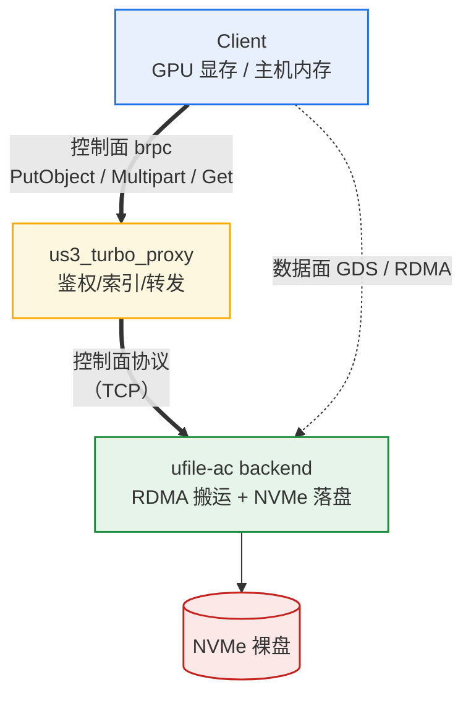
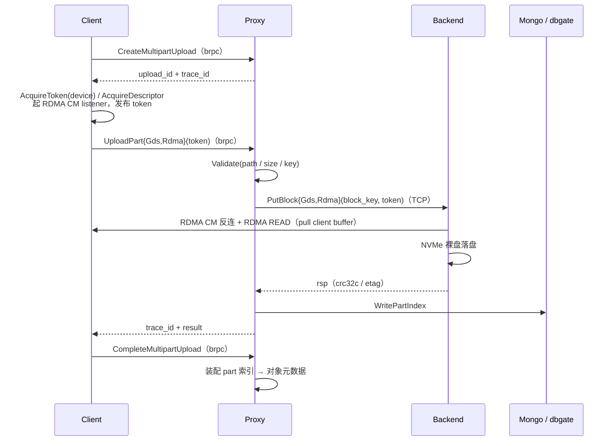
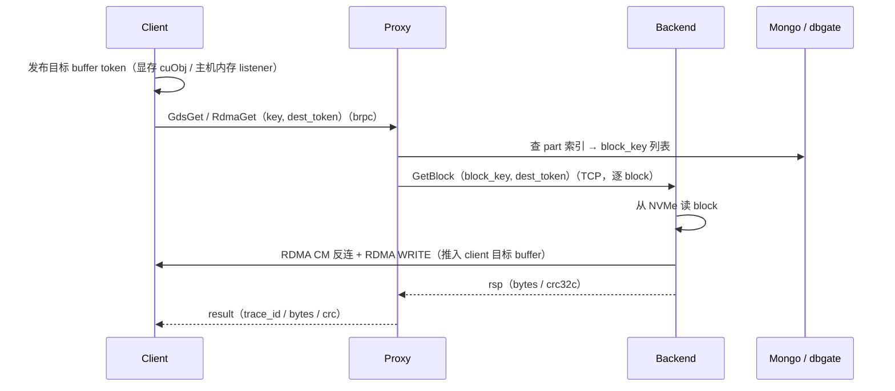

# Us3Turbo 项目介绍

> 面向高性能场景的 GDS + RDMA 双通路对象存储。

---

## 1 项目简介

### 1.1 系统定位

Us3Turbo 是一个把 **GPUDirect Storage（GDS）** 与 **RDMA（RoCE/InfiniBand）** 两条高速数据通路集成进对象存储语义的系统。它对外提供单步 PUT / 分段上传 / GET 三类对象存储接口，对内把数据搬运下沉到 GPU 显存直通（GDS cuObj）或主机内存 RDMA（libibverbs RC + RDMA CM），控制面统一走 brpc proxy。

**定位**：让 GPU / 主机内存与远端 NVMe 之间不再经过内核 TCP 协议栈和多次内存拷贝，把对象存储的易用接口接到 RDMA/GDS 的裸带宽上。

### 1.2 传统对象存储 vs 高性能对象存储

传统对象存储（以 S3 兼容的云对象存储、Ceph RGW、自建 HTTP 对象存储为代表）为"通用、弹性、多租户"而生，数据路径长：

| 维度 | 传统对象存储 | 高性能对象存储（Us3Turbo）|
|---|---|---|
| **访问协议** | HTTP/HTTPS + REST（S3 API）| brpc 控制面 + RDMA/GDS 数据面 |
| **数据路径** | 应用 → 内核 socket → TCP/IP 栈 → 用户态 web server → 内核 socket → 落盘，多段 `read/write`/`sendfile` 拷贝 | 应用 GPU/主机内存 → RDMA READ/WRITE 直达 backend NVMe，**零拷贝、绕内核 TCP** |
| **数据源** | 普通主机内存 buffer | **GPU 显存（GDS）** 或主机内存（RDMA），前者连 GPU 显存拷贝都省 |
| **单 RTT 延迟** | 百 µs ~ ms 级（含 TCP 握手、TLS、HTTP 解析）| µs 级 RDMA READ（RDMA READ 4M ~0.9 ms 端到端）|
| **单流带宽** | 受 TCP/单连接与 web server 串行化约束，常 1–3 GB/s 封顶 | 逼近 NVMe 写带宽上限（本机 ~3.3–3.9 GB/s）或主机侧搬运上限（约 10 GB/s）|
| **CPU 开销** | 每字节多 µs 的协议栈/加密/序列化开销，高并发即 CPU-bound | backend 真写仅 ~1 核（110% / 128 核），CPU 富余 |
| **语义模型** | 全量 PUT + multipart，part 较大（5–数 GB），看重持久化与一致性 | 同 S3 语义（单步 + multipart + GET），但 part 较小（4M/8M）以最大化并行度、充分利用 RDMA 队列深度 |
| **适合负载** | 通用文件、备份、静态资源、Web 资产 | 任何对单流带宽 / per-object 延迟 / CPU 旁路 / GPU 显存直通有诉求的高性能场景（AI checkpoint、HPC、大数据入湖、分布式冷层、高码率媒体等）|

核心差异不在"存了什么"，而在**数据搬运的路径深度**：

- 传统链路里，一次对象写要穿过"应用 buffer → 内核 send buffer → 网卡 → 交换 → 网卡 → 内核 recv buffer → 用户态 server → 再 write 到 NVMe"。每一跳是一次内存拷贝或上下文切换，且 TCP/IP 协议栈本身占用 CPU。
- Us3Turbo 里，GPU 显存的数据由 backend 用 **RDMA READ** 直接读取并落盘——GPU 上的训练张量不必先 `cudaMemcpy` 到主机内存再 `send`；主机内存的 buffer 也由 backend 用 RDMA READ 直读、用 RDMA WRITE 直写（GET）。中间没有 `read`/`write` 系统调用的数据拷贝，RDMA 旁路内核，TCP 协议栈不参与数据搬运（同机部署甚至走网卡内部 loopback，不经物理链路）。

**适用场景**：数据生产者/消费者已在 GPU 或主机内存中、单对象 GB 级、对单流带宽和 per-object 延迟敏感的高性能负载。定位为**通用高性能对象存储底座**，不限具体业务：

- **AI 训练 / 推理**：checkpoint 落盘、KV cache offload（见 `MOONCAKE_OFFLOAD_SOLUTION.md`）、模型权重分发、GPU 显存大数据集直接读取——数据天然在显存，GDS 通路连 `cudaMemcpy` 都省。
- **HPC / 科学计算**：大规模模拟输出、气象/地质/基因组数据的中间产物在节点间流动，RDMA 通路充分利用 RNIC 带宽，避免 TCP 协议栈占用 CPU。
- **大数据 / 流计算**：shuffle 中间态、列存快照的高速入湖与回读，单流带宽逼近 NVMe 天花板，降低流水线 stall。
- **分布式存储 / 缓存层**：作为持久、跨集群、可扩容的远端冷层或共享数据层，补足"快但节点本地"介质的持久性与跨节点共享能力。
- **视频 / 媒体处理**：高码率素材的高速 ingest 与分发，单流吞吐不再是瓶颈。

综上，对上述任一项有诉求的场景，均属于 Us3Turbo 的目标负载。

---

## 2 系统架构

### 2.1 三层拓扑

系统分三层，**控制面（brpc / TCP 协议）** 与 **数据面（RDMA / GDS）** 严格分离：控制面经 proxy 转发，数据面 client 与 backend 直连旁路 proxy。



图例：**粗实线** 控制面（client → proxy → backend，经 proxy 转发）；**虚线** 数据面（client ↔ backend 直连，旁路 proxy）。

### 2.2 Client

Client 提供 SDK：管理数据 buffer（GPU 显存或主机内存），为每个对象发布自描述 token 供 backend 反向连接并 RDMA 搬运，控制面 RPC 经 brpc 发往 proxy。两条通路在请求时选择：

| 维度 | **GDS 通路** | **RDMA 通路** |
|---|---|---|
| **数据源 buffer** | GPU 显存（device memory）| 主机内存（host memory）|
| **token 载体** | cuObj RDMA token（显存地址 + remote key 自描述串）| hex 串，含 listener 地址 + rkey + addr + size |
| **连接建立** | cuObj 链路 | RDMA CM（client 起 listener，backend 反向连接）|
| **搬运原语** | GDS RDMA READ，backend 拉 GPU 显存 → NVMe | RDMA READ（RC QP），backend 拉主机内存 → NVMe |
| **GET** | RDMA WRITE 回 client 显存 | RDMA WRITE 回 client 主机内存 |
| 省去的开销 | 连 `cudaMemcpy(host)` 都省，GPU 张量直接读写、无中转拷贝 | 省内核 TCP/`send`/`recv` 拷贝，host buffer 零拷贝 |
| **适用** | 训练 checkpoint 落盘 / KV cache 直接读取，GPU 侧零额外拷贝 | 主机侧大对象、非 CUDA 数据、跨进程共享内存 |

> 采用 pull（RDMA READ）而非 push（RDMA WRITE）模型：client 的 buffer 地址/钥匙由 client 自描述发布，backend 解码后主动拉取，client 无需预先开辟接收缓冲，也无需向对端暴露自身内存布局——契合对象存储"client 多变、backend 固定"的不对称关系。

### 2.3 Proxy（us3_turbo_proxy）

proxy 是控制面枢纽：基于 `control_plane.proto` 与 brpc，接收 client RPC，校验并同步转发 backend，持有分段会话，写 part 索引。核心设计是**统一 PutObject 接口 + 通路枚举**——请求携带 `path`（PATH_GDS / PATH_RDMA）选择通路，并按通路附带对应数据源（GDS → cuObj token，RDMA → listener 地址 / rkey / addr / size）。

- **集中转发**：client 只与 proxy 交互，proxy 同步转发 backend；数据面则由 client 与 backend 直连。鉴权、限流、part 索引统一在 proxy 完成。
- **每条通路一组独立 RPC**（单步 PutObject、分段 UploadPart、GET 各一套 GDS / RDMA 接口），通路之间互不影响。
- **trace_id 贯穿全链路**：proxy 为每个请求生成唯一 trace_id，写入索引、后端协议与日志，并随响应回传；排查任一对象只需按该 id 检索。

**内部分层**：

```
ProxyService（brpc 服务入口：鉴权 / 转发 / 访问日志）
   ├── SinglePut     单步上传
   ├── Multipart      分段上传会话（内存态，过期由 TTL 索引回收）
   └── GetObject      下载
         ├── 连接池    proxy→backend TCP 连接复用
         └── 索引模块  part 元数据持久化（GET 装配靠它）
```

- proxy 本身无状态：分段会话驻留内存，过期由索引层 TTL 回收，无需后台线程。
- 连接池大小决定 proxy→backend 并发度，需与 brpc 工作线程数匹配；实测 GDS 对其敏感、RDMA 不敏感。
- 分段 part 大小是硬上限，client 须与配置一致，否则被拒。

### 2.4 ufile-ac（backend）

backend 是独立部署的 ufile-ac 进程，proxy 通过自定义二进制协议与之通信。关键设计：

- **裸盘直写**：NVMe 整盘裸用，**不经任何文件系统**，libaio 直接提交 NVMe 队列，避开 page cache 与 inode 开销。
- **worker 线程池**：每通路 4 线程，接 RDMA READ 完成后串行落盘；主循环串行调度。
- **内存注册池**：RDMA 每次注册内存原为 ~7 ms 瓶颈，已用注册池摊销到接近 0。
- **搬运与落盘可分离**：可跳过落盘单独测数据搬运能力（§3 中 mock 数值即搬运-only）。

### 2.5 数据流时序

两条主流程的端到端时序：控制面（实线）经 proxy 转发，数据面（RDMA READ/WRITE）由 client 与 backend 直连。

**分段上传（PUT）**



**下载（GET）**



> PUT 与 GET 的数据面方向相反：PUT 由 backend RDMA READ 拉 client buffer 落盘，GET 由 backend 从 NVMe 读出后 RDMA WRITE 推入 client 目标 buffer；控制面路径一致（client → proxy → backend）。每个 part 以唯一 key 索引，GET 时按 key 装配还原对象；trace_id 贯穿全链路日志，排查任一对象只需按 id 检索。

---

## 3 性能

### 3.1 测试环境

| 项 | 配置 |
|---|---|
| CPU | Xeon 8358P，128 核 |
| 内存 | 2.0 TiB |
| GPU | 8× A800-SXM4-80GB（GDS 用 GPU0）|
| RNIC | 100Gb ConnectX-6 Dx |
| NVMe | 7.15 TiB 裸盘，TLC 稳态（累计写入 82 TB）|
| 部署 | 同机（client = proxy = backend）|

> 以下为预热后的稳态值：重启后冷态写吞吐会暂时降至 ~1.7G，需预热数轮方回到稳态；数据取自 TLC 稳态（SLC 缓存已耗尽）。

### 3.2 GDS 通路性能

| 指标 | 值 |
|---|---|
| 真写吞吐 | ~3.30 GiB/s（8 轮稳态均值，±6%）|
| 真读吞吐 | ~4.6 GiB/s（并发 16）|
| 仅搬运（跳过落盘）| ~3.73 GiB/s，比真写 +13% |
| backend CPU | ~110%（≈1 核 / 128 核）|
| NVMe 写利用率 | 84%（~3.3 GB/s）|

真写瓶颈在 NVMe 落盘与 worker 线程池排队；数据搬运（RDMA READ）本身仅 ~0.9 ms，非瓶颈。

### 3.3 RDMA 通路性能

| 指标 | 值 |
|---|---|
| 真写吞吐 | ~3.7 GiB/s（8 轮稳态均值，±4%）|
| 真读吞吐 | ~4.7 GiB/s（并发 16）|
| 仅搬运（跳过落盘）| ~9.8–10.4 GiB/s，比真写 +162% |
| backend CPU | ~92%（≈0.9 核 / 128 核）|
| NVMe 写利用率 | 99%（~3.9 GB/s）|

真写瓶颈在 NVMe 落盘（占后端 ~70%）与 proxy↔backend 往返；搬运能力被落盘掩盖，故 mock 下可达 ~10G。RDMA 提交队列更深，NVMe 利用率与吞吐均高于 GDS。

### 3.4 两通路对比与关键发现

| 维度 | GDS | RDMA |
|---|---|---|
| 真写 | ~3.30G | ~3.7G |
| 真读 | ~4.6G | ~4.7G |
| mock 搬运 | ~3.73G | ~9.8G |
| NVMe util（真写）| 84% | 99% |
| 数据源 | GPU 显存 | 主机内存 |

**关键发现**（均经多轮复测确认）：

1. **NVMe 写带宽是真写共同天花板**：GDS ~3.3G / RDMA ~3.7G，差异来自 AIO 队列深度而非搬运能力。mock 下两路搬运能力差距巨大（GDS ~3.7G / RDMA ~9.8G），但被 NVMe 落盘统一收敛到 ~3.3–3.7G。
2. **数据搬运（RDMA READ）本身极快**（~0.9 ms），两端性能都消耗在搬运之外：真写受限于 NVMe 落盘，纯搬运受限于调度/框架往返与 worker 池长尾。
3. **同机部署下 RNIC 物理口流量全程 ≈0**：数据搬运走网卡内部 loopback 路径，**不经 100Gb 物理链路**。故 mock ~10G 非 RNIC 带宽上限，而是主机侧调度串行 + 往返的上限（backend CPU ~69% 仍有余量）。**跨机部署**才会经 RNIC 物理链路、受 100Gb 约束——跨机结论不可由同机数据外推。
4. **真写与 mock 的最优 part 相反**：真写瓶颈在 NVMe 写延迟，小 part（2M/4M）并行度高更优；mock 瓶颈在固定开销摊薄，大 part（8M）更优。调参不可把 mock 结论直接套用到真写。
5. **CPU / 内存 / RNIC 均非瓶颈**：CPU 富余 >120 核、内存 2 TiB；唯一硬件瓶颈是 NVMe 写带宽。

### 3.5 资源占用（稳态，part=4M/nt=8/cp=16/conc=16）

| 资源 | GDS 真写 | RDMA 真写 | GDS mock | RDMA mock |
|---|---|---|---|---|
| backend CPU | ~110%（1 核）| ~92% | ~165% | ~69% |
| backend RSS | ~1174 MiB | ~1119 MiB | ~601 MiB | ~1003 MiB |
| NVMe util | 84%（3.3G 写）| 99%（3.9G 写）| 0.05%（跳过）| 0.05%（跳过）|
| GPU0 显存 | ~1.45 GB（RDMA READ 源）| N/A（host 内存面）| ~1.45 GB | N/A |
| RNIC 物理口 | ≈0 | ≈0 | ≈0 | ≈0 |

### 3.6 已知瓶颈与优化方向

| 瓶颈 | 状态 |
|---|---|
| 内存注册开销 | 已用注册池消除（原 ~7 ms/请求）|
| NVMe 写带宽 | 硬件上限，真写主瓶颈 |
| worker 线程池排队 | 真写次要瓶颈 |
| 主循环调度串行 | 仅搬运（同机）瓶颈 |

**下一优化方向**（见 `MOONCAKE_OFFLOAD_SOLUTION.md`）：在跨机部署下，RNIC 物理链路将成为约束，需评估 100Gb 带宽是否够用、是否需要 Mooncake 风格的 P2P/RDMA 直连 offload 进一步减少中间跳数。

---

## 附录：文档地图

| 文档 | 内容 |
|---|---|
| `README.md` | 编译、启动、跑 bench 的操作手册 |
| `docs/GDS_REAL_RW_REPORT.md` | GDS 真读写全表复测（2026-08-11）|
| `docs/RDMA_PERF_REPORT.md` | RDMA 性能全表复测（2026-08-11）|
| `docs/TUNING_DEEP_ANALYSIS.md` | part_size / num_threads / conn_pool 三轴调参 |
| `docs/MOONCAKE_OFFLOAD_SOLUTION.md` | 接入 Mooncake KVCache 冷层的方案与动机 |
